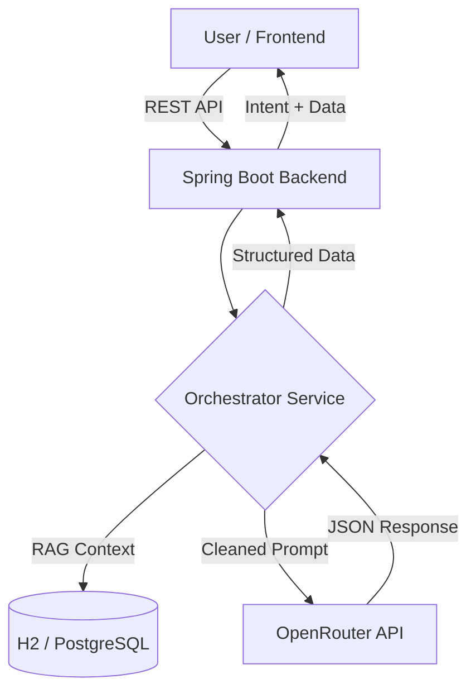
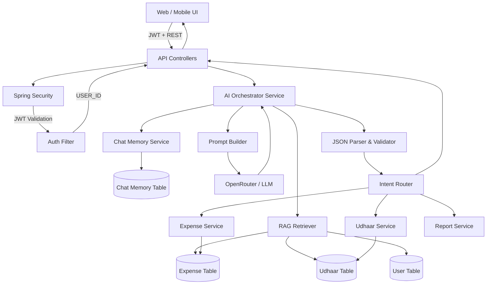
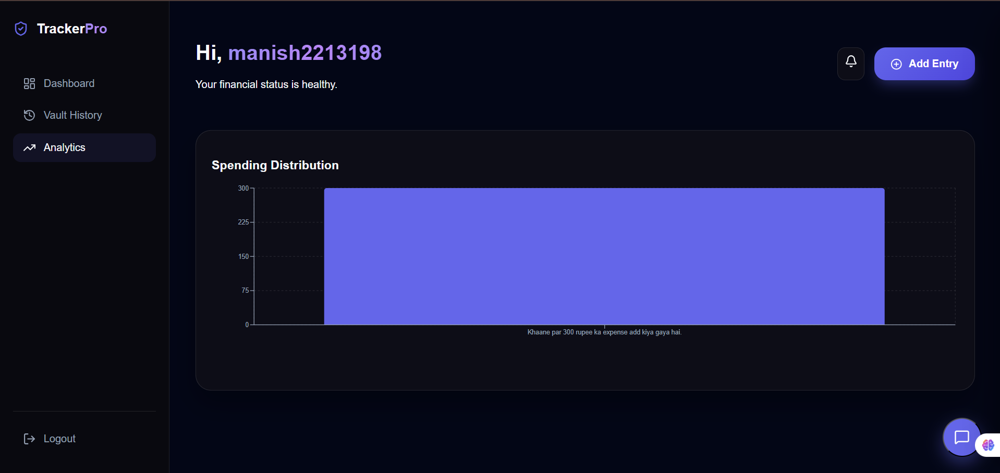
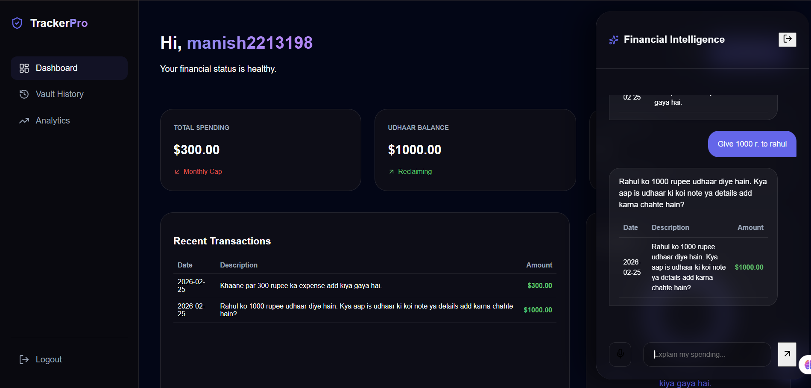

# 💰 AI Expense Tracker & Financial Assistant


A sophisticated, AI-driven personal finance management platform. This application allows users to track expenses, manage debts (Udhaar), and receive intelligent financial insights through a conversational interface powered by **Spring Boot** and **Large Language Models (LLMs)** via **OpenRouter**.


> **Live Demo:** [Insert Your Live Link Here] 🚀

---

## 🌟 Key Features

-   **Natural Language Tracking**: Add expenses or debts just by chatting (e.g., *"I spent 500 on dinner with Arjun"*).
-   **Intelligent Intent Classification**: Automatically detects if you are adding an expense, lending money, or asking for a report.
-   **RAG (Retrieval-Augmented Generation)**: The AI has memory of your past transactions and provides context-aware answers.
-   **Multi-lingual Support**: Chat in **English, Hindi, or Hinglish**.
-   **Visual Analytics**: View spending trends and breakdowns via dynamic charts.
-   **Udhaar Management**: Track money lent to or borrowed from friends with simple conversational commands.
-   **Proactive Suggestions**: Get personalized advice on how to save money based on your spending patterns.

---

## 🏗️ Technical Architecture

The project follows a modern decoupled architecture with a focus on AI orchestration.

### **System Diagram**



---

## 🧠 Deep System Architecture (Behind the Scenes)

This diagram represents the internal working of the system, showing
authentication, AI orchestration, chat memory, RAG pipeline, and domain services.
It reflects how the system is designed to scale into microservices in the future.


---

### **Core Stack**
-   **Frontend**: React 19, Vite, Tailwind CSS, Framer Motion (Animations), Recharts (Data Viz).
-   **Backend**: Java 17, Spring Boot 3.3.x, Spring Data JPA.
-   **Database**: H2 (Development) / PostgreSQL (Production).
-   **AI Engine**: OpenRouter (Mistral 7B / Llama 3) with custom RAG implementation.

---

## 🤖 Spring AI & Orchestration (Deep Dive)

The heart of this project is the **AI Orchestration Layer**, which bridge the gap between unstructured user input and structured financial data.

### **1. The Orchestrator Flow**
Unlike simple chatbots, our `OrchestratorService` performs several steps:
1.  **Context Retrieval (RAG)**: Before calling the AI, it fetches the user's recent transactions (expenses and udhaars) from the database.
2.  **Prompt Engineering**: It injects this data into a `SystemPrompt` which contains strict rules, security guidelines, and few-shot examples.
3.  **LLM Interaction**: The prompt is sent to an LLM. The LLM is instructed to return **Strict JSON** only.
4.  **Intent Mapping**: The response is parsed into one of the following intents:
    -   `ADD_EXPENSE`
    -   `UDHAAR_GIVEN` / `UDHAAR_TAKEN`
    -   `SHOW_REPORT`
    -   `QUERY_HISTORY`
    -   `DELETE_ENTRY`
    -   `GET_SUGGESTIONS`
5.  **Action Execution**: The service automatically calls the corresponding repository method to update the database.

### **2. Internal AI Components**
-   **`OpenRouterAiService`**: A custom implementation using Spring `WebClient` to communicate with LLM providers asynchronously and securely.
-   **`SystemPrompt`**: A carefully crafted base prompt that acts as the "Software Specification" for the AI, ensuring it behaves like a financial expert.
-   **`AiIntentResponse`**: A DTO that maps the LLM's JSON output to Java objects, enabling type-safe processing.

### **3. RAG Architecture**
We implement a lightweight RAG pattern:
-   **Retrieval**: Data is sliced by `USER_ID` to ensure strict privacy.
-   **Augmentation**: The top 10 most recent records are formatted into a human-readable string and placed in the `<context>` tag of the prompt.
-   **Generation**: The LLM uses this context to answer questions like *"How much did I spend on coffee last week?"* without needing a separate vector database for simple historical queries.

---

## 🚀 Getting Started

### **Prerequisites**
-   JDK 17 or higher
-   Node.js 18+
-   OpenRouter API Key

### **Backend Setup**
1. Navigate to `ai-expanse-tacker/`
2. Create a `.env` file based on `.env.example`:
   ```env
   OPENROUTER_API_KEY=your_key_here
   ```
3. Run the application:
   ```bash
   mvn spring-boot:run
   ```

### **Frontend Setup**
1. Navigate to `frontend/`
2. Install dependencies:
   ```bash
   npm install
   ```
3. Start the dev server:
   ```bash
   npm run dev
   ```

---

## 📸 Screenshots

| Dashboard | Chat Interface |
| :---: | :---: |
|  |  |

---


